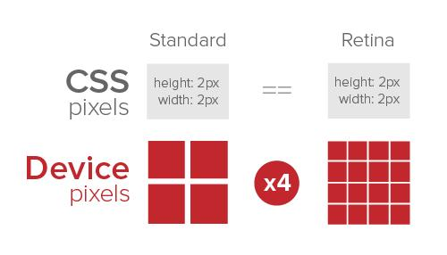

# 第八章 首页开发

## 第四节 课程卡片

## 组件拆分

- 卡片：链接 + 边框
  - 头部
  - 课程时间
  - 底部

## 物理 1px 边框

### 什么是物理 1px：

### 如何实现物理 1px 边框

- 0.5px： 部分 Android 不能支持小数
- 图片：一半透明，一半颜色， 不好定义颜色
- 伪元素 + 缩放（transform: scale）, 1px \* 0.5

## 头部

- tag，特殊图形的实现： 切图 or CSS
- 标题：换行 or 单行省略

## 课程时间

- 开课时间
- 课时数量

## 底部

### 教师区

- 布局：左半侧，最大数量：3
- 教师头像：半透明覆盖圆边框
- 教师名字

### 促销价格渲染逻辑

##### 普通：

- 原价
- 数量

##### 促销：

1. 促销期间：

- 划线原价
- 促价价格
- 倒计时

2. 促销结束/未开始：

- 原价
- 数量

### 价格

- 普通价格
- 划线价格

### 精确倒计时组件

- setTimeout/setInterval 是精确的吗？ （知识点：EventLoop）
- 每次获取当前时间校准
- Props：
  1. end： 终点时间
  2. onEnd： 结束回调
- State：
  - curTimeStamp： 当前时间

> 扩展思考：如果用户的本地时间不准确怎么办？

## 总结

- 复杂组件也可以拆分成小模块
- 业务逻辑要捋清楚再动手写
- 物理 1px
- CSS 特殊图形
- 精确倒计时（实际应用中的 EventLoop）
